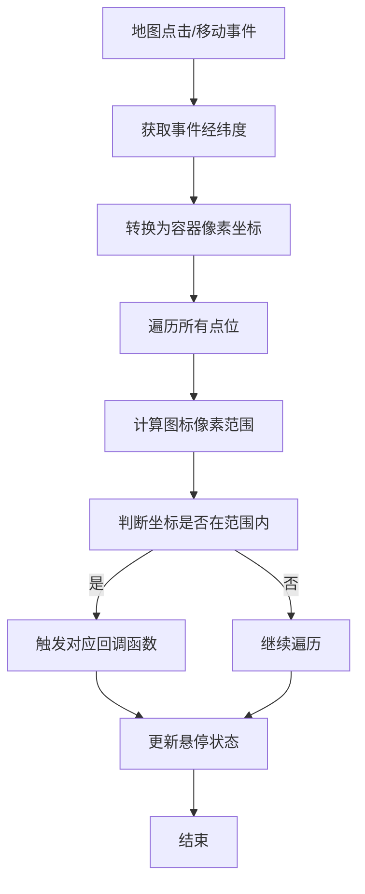

# ManyMarkersCanvas 类 API

<cite>
**本文档引用文件**   
- [LeafletManyPoint.ts](file://src/lib/LeafletManyPoint.ts#L8-L260)
</cite>

## 目录
1. [简介](#简介)
2. [构造函数](#构造函数)
3. [配置选项](#配置选项)
4. [公共方法](#公共方法)
5. [事件回调接口](#事件回调接口)
6. [TypeScript 接口定义](#typescript-接口定义)
7. [事件代理机制解析](#事件代理机制解析)

## 简介
`ManyMarkersCanvas` 是一个基于 Leaflet 的自定义图层类，专为高效渲染海量点位而设计。它通过 `Canvas` 实现高性能绘制，并支持点位点击、悬停等交互行为。该类继承自 `L.Layer`，利用事件代理机制实现对大量图标的高效事件响应，适用于大规模地理数据可视化场景。

## 构造函数
`ManyMarkersCanvas` 的构造函数通过 `L.Layer.extend` 扩展实现，接收点位数据数组作为初始化参数。

```typescript
new ManyMarkersCanvas(points: MarkerPointOptions[])
```

**参数说明：**
- `points`: 一个 `MarkerPointOptions` 类型的数组，定义了所有需要渲染的点位信息。

**Section sources**
- [LeafletManyPoint.ts](file://src/lib/LeafletManyPoint.ts#L29-L32)

## 配置选项
当前实现中，`ManyMarkersCanvas` 没有显式定义 `options` 参数对象，而是直接将传入的 `Points` 数组作为配置项处理。其核心配置通过 `MarkerPointOptions` 接口定义，每个点位可独立配置以下属性：

| 属性名 | 类型 | 是否必填 | 说明 |
|-------|------|--------|------|
| lat | number | 是 | 纬度坐标 |
| lng | number | 是 | 经度坐标 |
| title | string | 是 | 标签文本，用于在图标下方显示 |
| icon | string | 是 | 图标资源路径或 SVG 字符串 |
| iconSize | number[] | 是 | 图标尺寸，格式为 `[宽度, 高度]` |
| onIconClick | function | 否 | 点击图标时触发的回调函数 |
| onIconMouseOver | function | 否 | 鼠标移入图标时触发的回调函数 |
| onIconMouseOut | function | 否 | 鼠标移出图标时触发的回调函数 |

**Section sources**
- [LeafletManyPoint.ts](file://src/lib/LeafletManyPoint.ts#L8-L17)

## 公共方法

### addTo(map: L.Map)
将 `ManyMarkersCanvas` 图层添加到指定地图实例中，并初始化图标事件监听。

**作用机制：**
- 调用 `map.addLayer(this)` 将当前图层加入地图。
- 调用私有方法 `_initIconClickEvent()` 注册点击和鼠标移动事件监听器，实现交互功能。

**调用时机：**
应在地图初始化完成后调用此方法，确保 `map` 实例已准备就绪。

**Section sources**
- [LeafletManyPoint.ts](file://src/lib/LeafletManyPoint.ts#L34-L37)

### redraw()
触发图层重绘，清除当前画布内容并重新绘制所有可见点位。

**触发条件：**
- 当点位数据发生变更后，需手动调用此方法刷新视图。
- 内部在地图移动结束（`moveend`）和缩放（`resize`）时自动调用。

**性能影响：**
- 会清空画布并重新绘制所有在当前视口内的点位。
- 包含文本和图标绘制，性能开销主要集中在 `_drawIcon` 和 `_drawText` 方法。

**Section sources**
- [LeafletManyPoint.ts](file://src/lib/LeafletManyPoint.ts#L69-L70)

### _redraw(clear: boolean)
内部重绘方法，控制是否清除画布。

**执行流程：**
1. 调用 `addLayer()` 方法，该方法内部依次调用 `_drawIcon()` 和 `_drawText()` 进行绘制。
2. 若 `clear` 参数为 `true`，则调用 `clearRect` 清除整个画布区域，避免重叠绘制。

该方法被 `redraw()` 和 `_reset()` 方法调用，是重绘逻辑的核心。

**Section sources**
- [LeafletManyPoint.ts](file://src/lib/LeafletManyPoint.ts#L148-L152)

## 事件回调接口
`ManyMarkersCanvas` 支持以下三种事件回调，均通过 `MarkerPointOptions` 中的函数属性定义：

| 回调名称 | 触发时机 | 参数对象结构 |
|--------|---------|------------|
| onClick | 用户点击某个图标时 | 接收当前点位的完整 `MarkerPointOptions` 对象，包含 `lat`, `lng`, `title`, `icon` 等原始数据 |
| onMouseOver | 鼠标移入某个图标范围时 | 接收当前点位的完整 `MarkerPointOptions` 对象，同时地图容器的鼠标样式会自动变为指针 |
| onMouseOut | 鼠标移出某个图标范围时 | 接收当前点位的完整 `MarkerPointOptions` 对象，同时鼠标样式恢复默认 |

这些回调函数在事件代理机制中被动态调用，无需为每个图标单独绑定 DOM 事件。

**Section sources**
- [LeafletManyPoint.ts](file://src/lib/LeafletManyPoint.ts#L178-L260)

## TypeScript 接口定义
为确保类型安全和开发体验，提供以下 TypeScript 接口定义：

```typescript
export interface MarkerPointOptions {
  lat: number;
  lng: number;
  title: string;
  icon: string;
  iconSize: number[];
  onIconClick?: (item: MarkerPointOptions) => void;
  onIconMouseOver?: (item: MarkerPointOptions) => void;
  onIconMouseOut?: (item: MarkerPointOptions) => void;
}
```

开发者在使用时可直接导入该接口，获得完整的类型提示与自动补全支持。

**Section sources**
- [LeafletManyPoint.ts](file://src/lib/LeafletManyPoint.ts#L8-L17)

## 事件代理机制解析
`ManyMarkersCanvas` 通过事件代理机制实现高效交互响应，其核心原理如下：

1. **事件监听**：在 `_initIconClickEvent` 方法中，向地图实例注册全局 `click` 和 `mousemove` 事件监听。
2. **坐标转换**：当事件触发时，将鼠标事件的经纬度坐标转换为地图容器像素坐标（`containerPoint`）。
3. **范围检测**：遍历 `_pointList` 中所有点位，结合缓存的 `containerPointsCache` 和 `iconSize`，计算每个图标在画布上的像素范围。
4. **命中判断**：判断鼠标坐标是否落在某个图标的矩形区域内（`isInIcon` 条件）。
5. **回调触发**：若命中，则调用对应点位的 `onIconClick` 或 `onIconMouseOver` 回调函数。
6. **状态管理**：通过 `currentHoveredIcon` 变量跟踪当前悬停的图标，用于检测 `onMouseOut` 事件。

该机制避免了为每个点位创建独立 DOM 元素，显著提升了大规模点位场景下的交互性能。



**Diagram sources**
- [LeafletManyPoint.ts](file://src/lib/LeafletManyPoint.ts#L178-L260)

**Section sources**
- [LeafletManyPoint.ts](file://src/lib/LeafletManyPoint.ts#L178-L260)