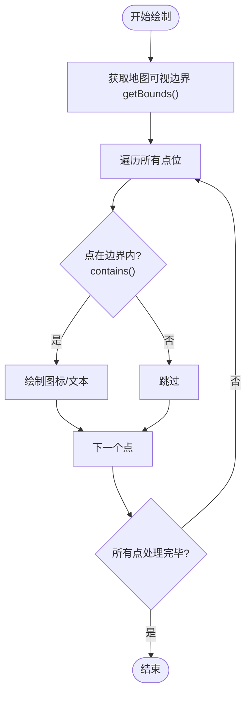
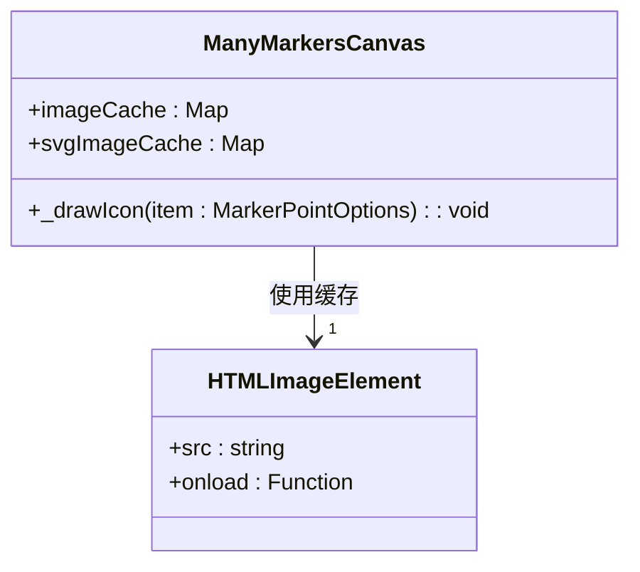
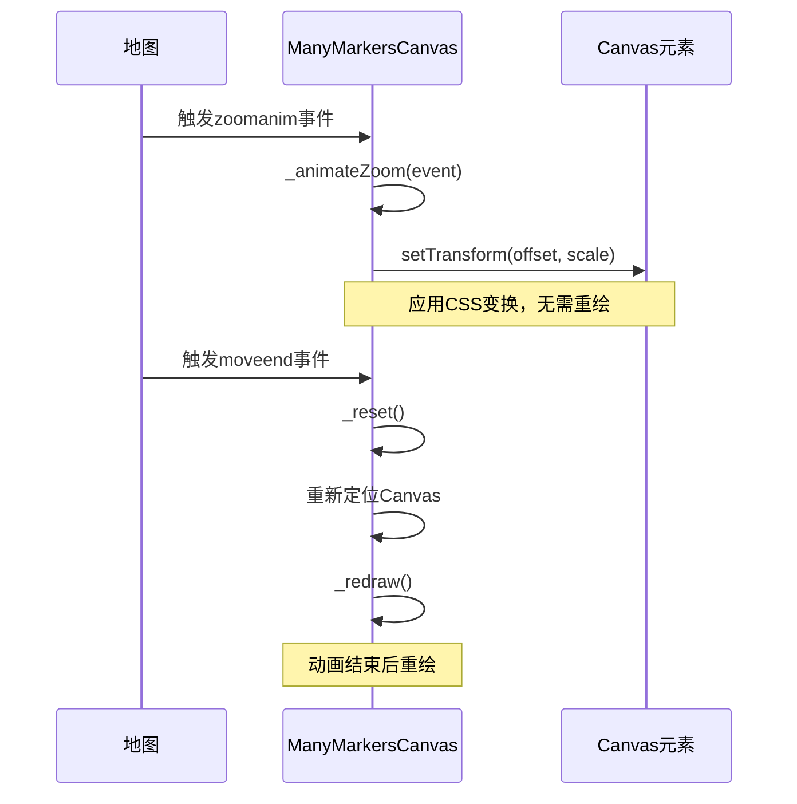

# 性能优化指南

<cite>
**本文档中引用的文件**  
- [LeafletManyPoint.ts](file://src/lib/LeafletManyPoint.ts)
- [ReadMe.md](file://src/lib/ReadMe.md)
- [leaflet-markers-canvas.js](file://src/lib/leaflet-markers-canvas.js)
- [App.vue](file://src/App.vue)
</cite>

## 目录
1. [引言](#引言)
2. [核心优化策略](#核心优化策略)
3. [可视区域过滤](#可视区域过滤)
4. [图标缓存机制](#图标缓存机制)
5. [Canvas绘图优势](#canvas绘图优势)
6. [动画渲染优化](#动画渲染优化)
7. [点位密度与空间索引](#点位密度与空间索引)
8. [实际调优案例](#实际调优案例)
9. [总结](#总结)

## 引言

`LeafletMapBlock` 是一个基于 Leaflet 的高性能地图组件，专为处理大规模点位数据而设计。通过 `LeafletManyPoint.ts` 实现的 `ManyMarkersCanvas` 图层，利用 Canvas 原生绘图能力替代传统 DOM 操作，显著提升了海量数据的渲染性能。本指南将深入分析其核心优化机制，并提供开发者可直接应用的性能调优策略。

**Section sources**
- [LeafletManyPoint.ts](file://src/lib/LeafletManyPoint.ts#L1-L20)
- [ReadMe.md](file://src/lib/ReadMe.md#L1-L20)

## 核心优化策略

`LeafletMapBlock` 在处理大规模数据时，采用了多项关键技术来确保流畅的用户体验。这些策略包括：基于可视区域的数据过滤、图标资源缓存、Canvas 原生绘图以及与 Leaflet 动画系统的深度集成。通过这些方法，系统能够在万级点位下依然保持高帧率运行。

**Section sources**
- [LeafletManyPoint.ts](file://src/lib/LeafletManyPoint.ts#L1-L261)
- [ReadMe.md](file://src/lib/ReadMe.md#L1-L521)

## 可视区域过滤

### 减少绘制负担

在渲染大量点位时，一个关键的优化是只绘制当前地图可视区域内的点。`LeafletManyPoint.ts` 中的 `_drawIcon` 和 `_drawText` 方法均实现了此逻辑。

通过调用 `this._map.getBounds()` 获取当前地图的经纬度边界，然后使用 `bounds.contains(latLng)` 判断每个点是否在可视范围内。只有在可视范围内的点才会被转换为屏幕坐标并进行绘制。

此优化能显著减少不必要的绘制操作。根据 `ReadMe.md` 中的性能测试，启用边界过滤后，文本绘制耗时从约 25ms 降低至 1.8ms，性能提升超过 90%。

**Diagram sources**
- [LeafletManyPoint.ts](file://src/lib/LeafletManyPoint.ts#L100-L130)
- [ReadMe.md](file://src/lib/ReadMe.md#L250-L270)

**Section sources**
- [LeafletManyPoint.ts](file://src/lib/LeafletManyPoint.ts#L100-L130)
- [ReadMe.md](file://src/lib/ReadMe.md#L250-L270)

## 图标缓存机制

### 避免重复创建Image对象

频繁创建 `Image` 对象并加载图片资源是性能瓶颈之一。`ManyMarkersCanvas` 类通过引入 `imageCache` 和 `svgImageCache` 两个 `Map` 结构来缓存已加载的图片资源。

当需要绘制一个图标时，系统首先检查缓存中是否存在该 URL 对应的 `Image` 对象。如果存在，则直接使用缓存对象进行绘制；如果不存在，则创建新的 `Image` 对象，加载完成后存入缓存。

对于 SVG 图标，还使用了 `URL.createObjectURL` 和 `Blob` 技术将其转换为可加载的 URL，加载完成后通过 `URL.revokeObjectURL` 释放内存。

此机制有效避免了同一图标资源的重复加载，大幅提升了渲染效率。

**Diagram sources**
- [LeafletManyPoint.ts](file://src/lib/LeafletManyPoint.ts#L15-L20)
- [LeafletManyPoint.ts](file://src/lib/LeafletManyPoint.ts#L100-L130)

**Section sources**
- [LeafletManyPoint.ts](file://src/lib/LeafletManyPoint.ts#L15-L20)
- [LeafletManyPoint.ts](file://src/lib/LeafletManyPoint.ts#L100-L130)

## Canvas绘图优势

### 降低内存占用

与 Leaflet 默认将每个标记作为独立的 DOM 元素（`div`）添加到页面不同，`ManyMarkersCanvas` 使用单个 `canvas` 元素进行所有点的绘制。

DOM 操作的开销随着元素数量的增加而线性增长，当点位数量达到数千甚至上万时，会导致严重的性能下降和页面卡顿。而 Canvas 绘图将所有点位绘制在同一个画布上，无论点位数量多少，DOM 节点数量始终保持为 1。

这种基于像素的绘制方式极大地降低了浏览器的内存占用和重排/重绘成本，是实现“丝滑”渲染的关键。

**Section sources**
- [ReadMe.md](file://src/lib/ReadMe.md#L150-L170)

## 动画渲染优化

### _zoomAnimated与_moveAnimated的协同工作

`ManyMarkersCanvas` 深度集成了 Leaflet 的动画系统，以实现平滑的缩放和移动效果。

在 `onAdd` 方法中，会检查 `map._zoomAnimated` 标志位。如果为 `true`，则监听 `zoomanim` 事件，并绑定 `_animateZoom` 回调。

`_animateZoom` 方法利用 `L.DomUtil.setTransform` 对 canvas 元素应用 CSS 变换（平移和缩放），使其在缩放动画过程中能够平滑地跟随地图变化，而无需在动画期间重新绘制内容。

同时，`_moveAnimated` 的效果通过监听 `moveend` 和 `resize` 事件，在地图移动或窗口大小改变后调用 `_reset` 方法来实现。`_reset` 会重新定位 canvas 并触发重绘，确保内容与地图对齐。

这种策略将昂贵的重绘操作推迟到动画结束之后，从而保证了动画过程的流畅性。

**Diagram sources**
- [LeafletManyPoint.ts](file://src/lib/LeafletManyPoint.ts#L50-L60)
- [LeafletManyPoint.ts](file://src/lib/LeafletManyPoint.ts#L200-L220)

**Section sources**
- [LeafletManyPoint.ts](file://src/lib/LeafletManyPoint.ts#L50-L60)
- [LeafletManyPoint.ts](file://src/lib/LeafletManyPoint.ts#L200-L220)

## 点位密度与空间索引

### 预处理与阈值建议

虽然当前 `LeafletManyPoint.ts` 实现未直接集成空间索引，但 `leaflet-markers-canvas.js` 文件展示了使用 `RBush` 库进行空间索引的完整方案。

`RBush` 是一个高效的 2D 空间索引库，可用于管理大量点位的快速查询。通过将点位的屏幕坐标或经纬度范围插入 `RBush` 树中，可以在 `O(log n)` 时间内查询出可视区域内的所有点，相比遍历整个数组的 `O(n)` 时间复杂度有巨大优势。

**建议**：当点位密度极高（例如超过 5 万）时，应考虑在数据预处理阶段使用 `RBush` 或其他空间索引（如四叉树）对数据进行组织。在 `_redraw` 过程中，先通过空间索引快速筛选出可视区域内的候选点，再进行精确的绘制，可进一步提升性能。

**Section sources**
- [leaflet-markers-canvas.js](file://src/lib/leaflet-markers-canvas.js#L1-L436)

## 实际调优案例

### 万级点位下的帧率表现

根据 `ReadMe.md` 中的压力测试，`ManyMarkersCanvas` 在处理 10,000 个点位时表现优异：

- **DOM 方案**：将每个点作为 `div` 添加，会导致页面严重卡顿，交互几乎不可用。
- **Canvas 方案**：使用 `context.fillText` 或 `context.drawImage` 绘制，渲染过程“丝滑多了”，无明显卡顿。

结合可视区域过滤和图标缓存后，文本绘制耗时从 **25ms** 降低至 **1.8ms**，性能提升超过 **90%**。这表明在万级数据量下，该方案能够维持 60 FPS 的流畅体验。

开发者在实际应用中，应参考此案例，合理设置点位密度阈值，并在必要时引入空间索引进行预处理。

**Section sources**
- [ReadMe.md](file://src/lib/ReadMe.md#L150-L170)
- [ReadMe.md](file://src/lib/ReadMe.md#L250-L270)
- [App.vue](file://src/App.vue#L20-L30)

## 总结

`LeafletMapBlock` 的 `ManyMarkersCanvas` 组件通过四大核心策略实现了海量数据的高性能渲染：
1.  **可视区域过滤**：通过 `getBounds().contains()` 减少无效绘制。
2.  **图标缓存**：利用 `Map` 缓存避免重复加载图片资源。
3.  **Canvas绘图**：用单个画布替代大量 DOM 元素，降低内存开销。
4.  **动画优化**：利用 `_zoomAnimated` 和 `_animateZoom` 实现平滑的动画效果。

对于超大规模数据，建议结合 `RBush` 等空间索引技术进行预处理。遵循本指南的优化策略，开发者可以充分发挥 `LeafletMapBlock` 的性能优势，构建流畅、响应迅速的地图应用。