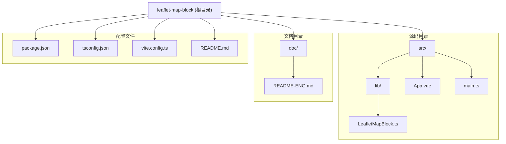
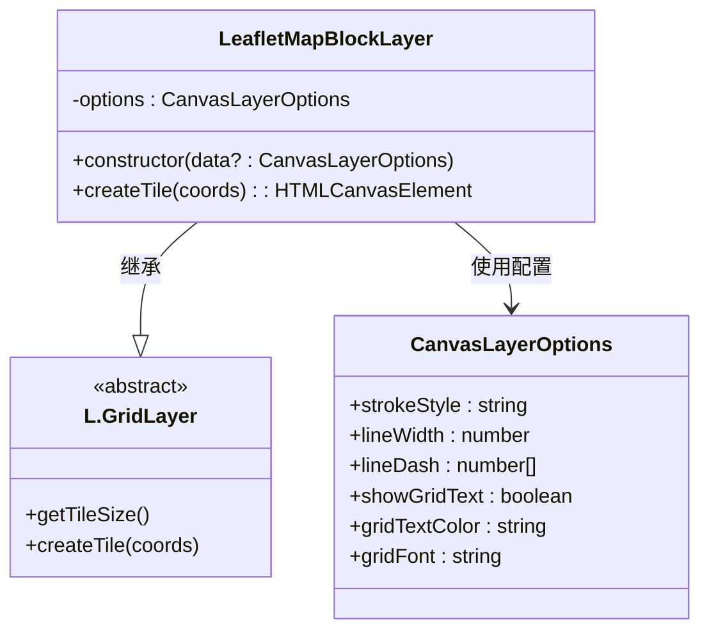
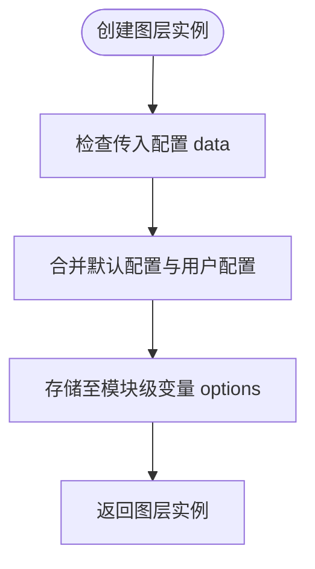
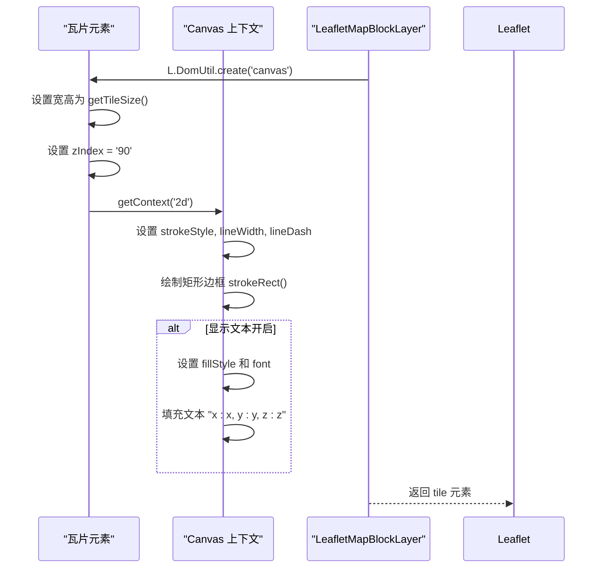
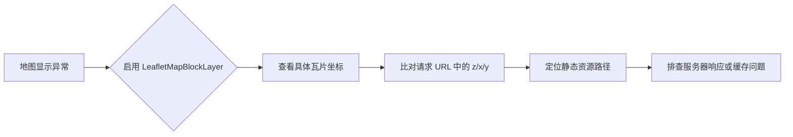

# 核心模块：地图网格标注（LeafletMapBlockLayer）

<cite>
**本文档中引用的文件**   
- [LeafletMapBlock.ts](file://src/lib/LeafletMapBlock.ts)
- [README.md](file://README.md)
- [doc/README-ENG.md](file://doc/README-ENG.md)
</cite>

## 目录
1. [简介](#简介)
2. [项目结构](#项目结构)
3. [核心组件](#核心组件)
4. [架构概述](#架构概述)
5. [详细组件分析](#详细组件分析)
6. [依赖分析](#依赖分析)
7. [性能考虑](#性能考虑)
8. [故障排查指南](#故障排查指南)
9. [结论](#结论)

## 简介
`LeafletMapBlockLayer` 是一个基于 Leaflet 的轻量级扩展图层，继承自 `L.GridLayer`，用于在地图瓦片上绘制带有边框和坐标文本的网格。该模块主要用于开发调试阶段，帮助开发者可视化地图瓦片的加载边界与坐标信息，快速定位地图渲染异常问题。通过自定义样式选项，用户可灵活控制网格线颜色、虚线样式、字体大小等外观属性。

## 项目结构
本项目采用标准的前端模块化结构，主要分为源码、文档和构建配置三大部分：



**Diagram sources**  
- [README.md](file://README.md#L1-L72)
- [project_structure](file://#L1-L20)

## 核心组件
`LeafletMapBlockLayer` 类是本模块的核心实现，作为 `L.GridLayer` 的子类，重写了 `createTile` 方法，利用 HTML5 Canvas 动态生成每个瓦片的视觉元素。其设计目标是轻量、高效且无侵入性，仅用于辅助开发调试。

**Section sources**  
- [LeafletMapBlock.ts](file://src/lib/LeafletMapBlock.ts#L1-L78)

## 架构概述
该模块遵循 Leaflet 插件的标准架构模式，通过继承 `L.GridLayer` 实现自定义瓦片渲染逻辑。整体架构简洁清晰，不依赖复杂状态管理，所有配置通过构造函数传入并合并默认值。



**Diagram sources**  
- [LeafletMapBlock.ts](file://src/lib/LeafletMapBlock.ts#L10-L78)

## 详细组件分析

### LeafletMapBlockLayer 实现分析

#### 构造函数与配置合并
构造函数接收可选的 `CanvasLayerOptions` 参数，并将其与默认配置进行合并，确保即使未传参也能正常渲染。配置项包括线条样式、文本显示开关及字体设置。



**Diagram sources**  
- [LeafletMapBlock.ts](file://src/lib/LeafletMapBlock.ts#L28-L37)

#### createTile 方法实现流程
`createTile` 方法是核心逻辑所在，负责为每个瓦片坐标 `(x, y, z)` 创建一个带边框和文本的 Canvas 元素。



**Diagram sources**  
- [LeafletMapBlock.ts](file://src/lib/LeafletMapBlock.ts#L39-L76)

#### 配置参数应用机制
所有绘图样式均通过 `options` 对象从构造函数传入，并在 `createTile` 中解构使用，确保样式一致性。

| 配置项 | 类型 | 默认值 | 用途 |
|--------|------|--------|------|
| `strokeStyle` | string | `'red'` | 边框颜色 |
| `lineWidth` | number | `2` | 边框线宽 |
| `lineDash` | number[] | `[5, 5]` | 虚线样式 |
| `showGridText` | boolean | `true` | 是否显示坐标文本 |
| `gridTextColor` | string | `'black'` | 文本颜色 |
| `gridFont` | string | `'12px Arial'` | 文本字体 |

**Section sources**  
- [LeafletMapBlock.ts](file://src/lib/LeafletMapBlock.ts#L10-L25)
- [README.md](file://README.md#L10-L30)

## 依赖分析
本模块依赖 Leaflet 核心库进行地图渲染和瓦片管理，同时支持 TypeScript 类型定义以提升开发体验。

```mermaid
dependencyDiagram
LeafletMapBlockLayer --> Leaflet : 依赖 L.GridLayer
LeafletMapBlockLayer --> TypeScript : 提供类型接口
LeafletMapBlockLayer -.-> Vite : 构建工具开发时
LeafletMapBlockLayer -.-> Vue : 示例应用框架
```

**Diagram sources**  
- [package.json](file://package.json#L1-L43)
- [LeafletMapBlock.ts](file://src/lib/LeafletMapBlock.ts#L1)

## 性能考虑
由于每个瓦片仅绘制一个矩形边框和一行文本，计算开销极小。Canvas 渲染本身高效，且图层 zIndex 设置为 90，避免干扰其他高优先级图层。该图层对整体性能影响几乎可以忽略，适合长期开启用于调试。

## 故障排查指南
该图层的主要用途是辅助排查地图瓦片加载问题：

- **定位异常瓦片**：通过观察 `x:y:z` 坐标，可快速识别加载失败或偏移的瓦片。
- **验证 URL 映射**：对比地图请求 URL 中的 `{z}/{x}/{y}` 与标注值是否一致，验证坐标转换逻辑。
- **调试加载顺序**：观察瓦片绘制顺序，辅助分析加载策略或缓存机制。



**Section sources**  
- [README.md](file://README.md#L54-L71)
- [doc/README-ENG.md](file://doc/README-ENG.md#L53-L72)

## 结论
`LeafletMapBlockLayer` 是一个简洁高效的调试工具，通过可视化地图瓦片边界与坐标信息，极大提升了地图开发过程中的问题排查效率。其轻量设计和灵活配置使其成为 Leaflet 开发者不可或缺的辅助组件。