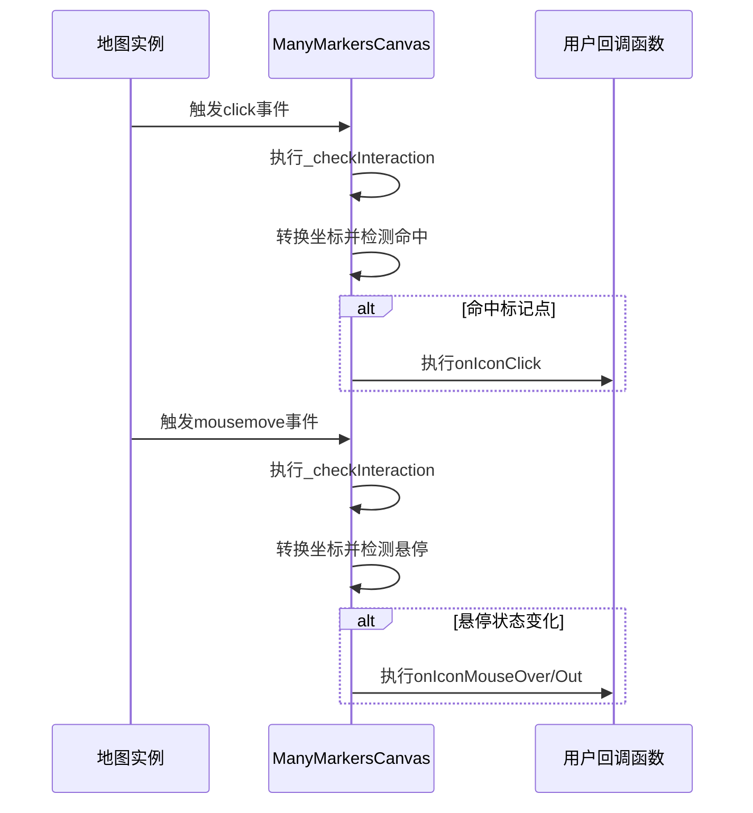
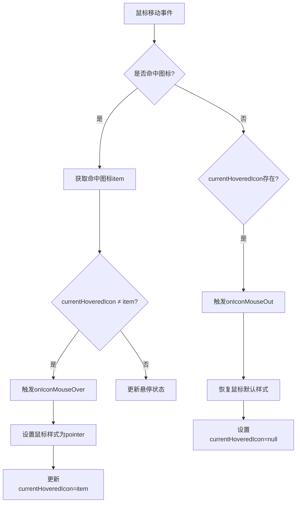
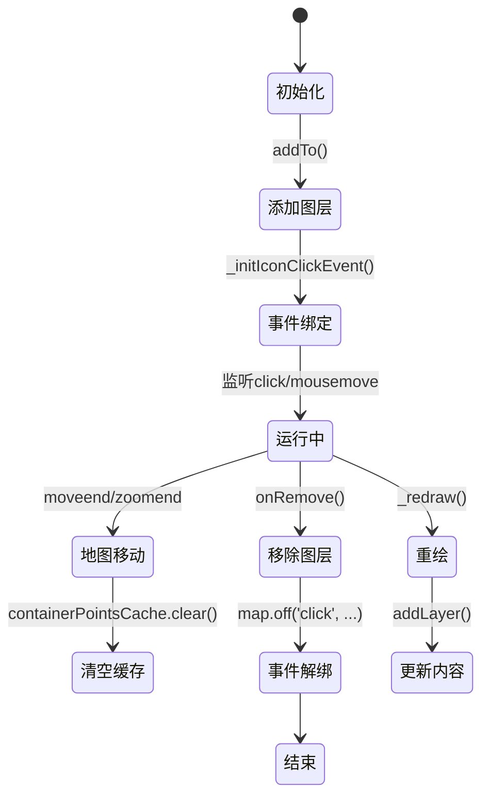

# 事件处理机制

<cite>
**Referenced Files in This Document**   
- [LeafletManyPoint.ts](file://src/lib/LeafletManyPoint.ts)
- [leaflet-markers-canvas.js](file://src/lib/leaflet-markers-canvas.js)
- [ReadMe.md](file://src/lib/ReadMe.md)
</cite>

## Table of Contents
1. [事件代理机制概述](#事件代理机制概述)
2. [全局事件捕获与坐标转换](#全局事件捕获与坐标转换)
3. [用户回调函数触发机制](#用户回调函数触发机制)
4. [悬停状态管理与优化](#悬停状态管理与优化)
5. [事件生命周期管理](#事件生命周期管理)

## 事件代理机制概述

ManyMarkersCanvas 组件通过事件代理模式实现了对海量标记点的高效事件处理。该机制不直接为每个标记点绑定事件监听器，而是通过监听地图实例的全局事件来统一捕获用户交互，从而避免了因大量DOM事件监听器导致的性能问题和内存泄漏风险。

核心设计思想是将事件处理逻辑从个体标记点上抽离，集中到图层级别进行统一管理。当用户与地图交互时，系统首先捕获原始事件，然后通过空间索引结构快速定位到被交互的标记点，并触发相应的用户定义回调函数。

**Section sources**
- [LeafletManyPoint.ts](file://src/lib/LeafletManyPoint.ts#L100-L102)
- [ReadMe.md](file://src/lib/ReadMe.md#L412-L449)

## 全局事件捕获与坐标转换

### 事件绑定策略

ManyMarkersCanvas 在 `onAdd` 生命周期钩子中向地图实例注册了 `click` 和 `mousemove` 事件监听器。这种全局事件捕获方式确保了无论地图如何缩放或平移，事件监听都能持续有效。

**Diagram sources**
- [LeafletManyPoint.ts](file://src/lib/LeafletManyPoint.ts#L100-L102)
- [LeafletManyPoint.ts](file://src/lib/LeafletManyPoint.ts#L200-L258)

### 坐标转换与命中检测

系统通过 `_layerPointToDataPoint` 方法（在代码中体现为 `latLngToContainerPoint` 的逆向逻辑）将鼠标事件的像素坐标转换为数据点坐标。具体流程如下：

1. 从事件对象中提取 `containerPoint`（鼠标在地图容器内的像素坐标）
2. 遍历 `_pointList` 中的所有数据点，使用 `latLngToContainerPoint` 将每个数据点的经纬度转换为屏幕坐标
3. 根据图标尺寸计算其包围盒范围（左上角x,y坐标及右下角x,y坐标）
4. 判断鼠标坐标是否落在任一图标的包围盒内，实现命中检测

该过程通过 `containerPointsCache` 缓存机制优化性能，避免重复进行坐标转换计算。

**Section sources**
- [LeafletManyPoint.ts](file://src/lib/LeafletManyPoint.ts#L200-L258)
- [ReadMe.md](file://src/lib/ReadMe.md#L412-L449)

## 用户回调函数触发机制

### 回调函数定义

用户可通过 `MarkerPointOptions` 接口定义三种回调函数：
- `onIconClick`: 点击标记点时触发
- `onIconMouseOver`: 鼠标进入标记点区域时触发
- `onIconMouseOut`: 鼠标离开标记点区域时触发

### 触发条件与参数传递

| 回调类型 | 触发条件 | 参数传递 |
|--------|--------|--------|
| onClick | 鼠标点击且命中图标区域 | 原始事件对象 `e` 和绑定的 `data` 数据 |
| onMouseOver | 鼠标移动且进入新图标区域 | 原始事件对象 `e` 和绑定的 `data` 数据 |
| onMouseOut | 鼠标移动且离开当前悬停图标 | 原始事件对象 `e` 和绑定的 `data` 数据 |

系统确保只有当鼠标真正进入或离开图标区域时才触发相应的悬停回调，避免了频繁的重复触发。

**Section sources**
- [LeafletManyPoint.ts](file://src/lib/LeafletManyPoint.ts#L10-L17)
- [LeafletManyPoint.ts](file://src/lib/LeafletManyPoint.ts#L200-L258)

## 悬停状态管理与优化

### 进入/离开判断逻辑

系统使用 `currentHoveredIcon` 变量记录上一个悬停的标记点，实现精确的进入/离开状态判断：

**Diagram sources**
- [LeafletManyPoint.ts](file://src/lib/LeafletManyPoint.ts#L220-L250)

### 性能优化策略

1. **坐标缓存机制**：使用 `containerPointsCache` Map 对象缓存已计算的屏幕坐标，地图平移缩放时清空缓存
2. **可视范围过滤**：仅对当前地图视口内的标记点进行坐标转换和命中检测
3. **事件节流**：依赖浏览器原生的事件频率控制，避免手动实现节流带来的复杂性
4. **批量处理**：在 `_drawIcon` 和 `_drawText` 方法中批量处理所有标记点的渲染

这些优化策略显著提升了海量数据场景下的交互性能。

**Section sources**
- [LeafletManyPoint.ts](file://src/lib/LeafletManyPoint.ts#L200-L258)
- [ReadMe.md](file://src/lib/ReadMe.md#L412-L449)

## 事件生命周期管理

### 事件绑定与解绑

事件的生命周期与图层的生命周期严格对应：

**Diagram sources**
- [LeafletManyPoint.ts](file://src/lib/LeafletManyPoint.ts#L80-L82)
- [LeafletManyPoint.ts](file://src/lib/LeafletManyPoint.ts#L100-L102)

### 内存泄漏防护

系统通过以下机制确保无内存泄漏：
1. 在 `onRemove` 钩子中显式移除所有事件监听器
2. 使用弱引用缓存策略，允许垃圾回收
3. 图层销毁时自动清理所有内部状态变量
4. 事件监听器绑定时指定上下文（`this` 参数），确保正确解绑

**Section sources**
- [LeafletManyPoint.ts](file://src/lib/LeafletManyPoint.ts#L80-L82)
- [LeafletManyPoint.ts](file://src/lib/LeafletManyPoint.ts#L100-L102)