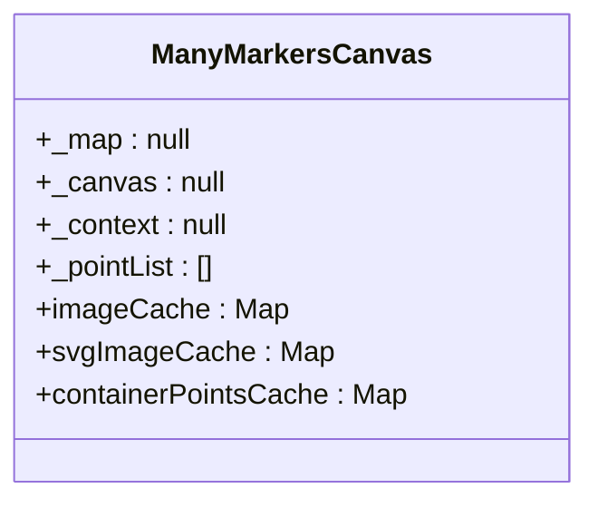
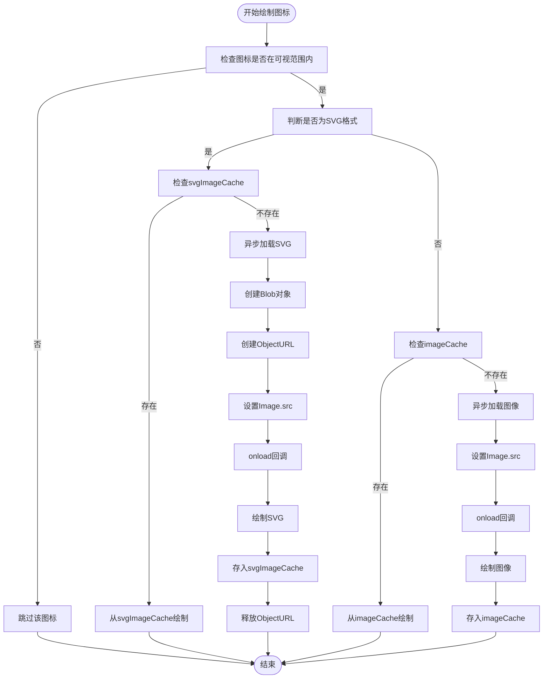
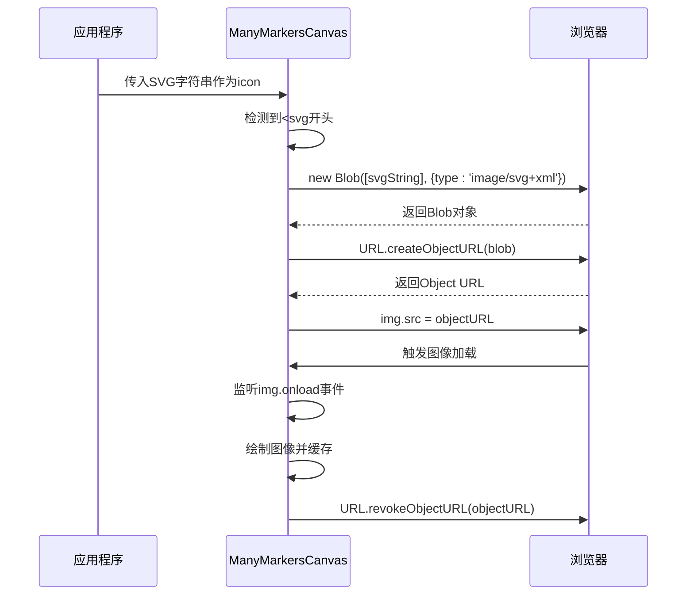
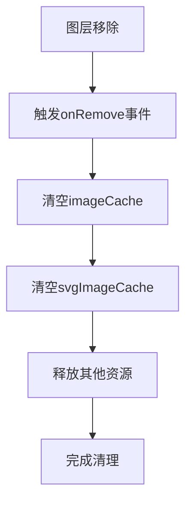

# 图标资源管理

<cite>
**本文档引用文件**   
- [LeafletManyPoint.ts](file://src/lib/LeafletManyPoint.ts)
- [ReadMe.md](file://src/lib/ReadMe.md)
</cite>

## 目录
1. [图标缓存机制概述](#图标缓存机制概述)
2. [静态缓存对象设计](#静态缓存对象设计)
3. [异步加载与缓存实现](#异步加载与缓存实现)
4. [SVG字符串特殊处理](#svg字符串特殊处理)
5. [使用建议与性能优化](#使用建议与性能优化)
6. [缓存清理策略](#缓存清理策略)

## 图标缓存机制概述

ManyMarkersCanvas 组件通过实现图标缓存机制，有效解决了海量图标渲染时的性能瓶颈问题。该机制通过在类级别维护两个静态 Map 缓存对象，避免了相同图标资源的重复加载，显著提升了渲染效率。当需要渲染大量标记点时，这种缓存策略能够大幅减少网络请求和图像解码开销，确保地图操作的流畅性。

**Section sources**
- [LeafletManyPoint.ts](file://src/lib/LeafletManyPoint.ts#L25-L26)
- [ReadMe.md](file://src/lib/ReadMe.md#L270-L279)

## 静态缓存对象设计

组件设计了两个静态缓存对象 `imageCache` 和 `svgImageCache`，分别用于存储普通图像和 SVG 图像的缓存。这两个对象均采用 Map 数据结构，以图标 URL 作为键值，对应的 Image 对象作为值。

**Diagram sources**
- [LeafletManyPoint.ts](file://src/lib/LeafletManyPoint.ts#L24-L27)

`imageCache` 专门用于缓存 PNG、JPG 等常规图像格式，而 `svgImageCache` 则专门处理 SVG 格式的图标。这种分离设计确保了不同类型的图像资源能够被正确管理和访问。通过使用图标 URL 作为键值，系统能够快速判断某个图标是否已被加载，从而避免重复的异步加载过程。

**Section sources**
- [LeafletManyPoint.ts](file://src/lib/LeafletManyPoint.ts#L25-L26)
- [ReadMe.md](file://src/lib/ReadMe.md#L270-L279)

## 异步加载与缓存实现

图标加载通过 `_drawIcon` 方法实现，该方法在渲染过程中异步加载并缓存图标资源。对于非 SVG 图像，系统首先检查 `imageCache` 中是否存在对应 URL 的缓存，若存在则直接使用缓存的 Image 对象进行绘制；若不存在，则创建新的 Image 对象，设置其 src 属性触发异步加载，并在 `onload` 回调中将加载完成的图像存入缓存。

**Diagram sources**
- [LeafletManyPoint.ts](file://src/lib/LeafletManyPoint.ts#L96-L179)

对于 SVG 图像，处理流程更为复杂。系统需要将 SVG 字符串转换为 Blob 对象，然后通过 `URL.createObjectURL()` 创建临时的 Object URL，再将此 URL 赋给 Image 对象的 src 属性进行加载。加载完成后，不仅需要将 Image 对象存入 `svgImageCache`，还需要调用 `URL.revokeObjectURL()` 释放临时 URL，防止内存泄漏。

**Section sources**
- [LeafletManyPoint.ts](file://src/lib/LeafletManyPoint.ts#L96-L179)
- [ReadMe.md](file://src/lib/ReadMe.md#L281-L328)

## SVG字符串特殊处理

组件支持将 SVG 字符串直接作为 `iconUrl` 传入，这是一种特殊的处理流程。当检测到 `icon` 字符串以 `<svg` 开头时，系统会将其识别为内联 SVG 数据而非外部资源 URL。处理流程如下：首先将 SVG 字符串包装成 Blob 对象，指定 MIME 类型为 `image/svg+xml`；然后使用 `URL.createObjectURL()` 将 Blob 转换为可在浏览器中引用的 data URL；最后将此 data URL 赋给 Image 对象的 src 属性进行加载。

**Diagram sources**
- [LeafletManyPoint.ts](file://src/lib/LeafletManyPoint.ts#L114-L125)
- [ReadMe.md](file://src/lib/ReadMe.md#L219-L251)

这种设计使得开发者可以直接在代码中定义 SVG 图标，无需额外的文件资源，提高了开发灵活性。同时，通过缓存机制，即使多个标记使用相同的 SVG 字符串，也只会进行一次解析和加载。

**Section sources**
- [LeafletManyPoint.ts](file://src/lib/LeafletManyPoint.ts#L114-L125)
- [ReadMe.md](file://src/lib/ReadMe.md#L219-L251)

## 使用建议与性能优化

为确保最佳性能，建议使用统一尺寸的图标。这可以减少因图标尺寸不同而导致的频繁重绘操作，提高渲染效率。同时，应避免使用过大或过多不同类型的图标，因为这会显著增加内存占用和 GPU 渲染开销。

在实际应用中，应优先考虑使用精灵图（Sprite Sheet）或字体图标等技术来进一步优化图标渲染性能。对于海量数据场景，除了图标缓存外，还应结合可视范围过滤技术，只渲染当前视口内的标记，这能大幅减少需要处理的图标数量。

**Section sources**
- [ReadMe.md](file://src/lib/ReadMe.md#L328-L347)

## 缓存清理策略

虽然组件目前未提供显式的缓存清理方法，但建议在图层移除时主动释放相关资源。可以通过监听图层的 `onRemove` 事件，在事件处理函数中清空 `imageCache` 和 `svgImageCache` 缓存，或将其重新初始化为空的 Map 对象。

**Diagram sources**
- [LeafletManyPoint.ts](file://src/lib/LeafletManyPoint.ts#L70-L74)

这种主动清理策略有助于防止内存泄漏，特别是在频繁创建和销毁图层的场景下尤为重要。开发者应根据具体应用场景，制定合适的缓存生命周期管理策略。

**Section sources**
- [LeafletManyPoint.ts](file://src/lib/LeafletManyPoint.ts#L70-L74)
- [ReadMe.md](file://src/lib/ReadMe.md#L347-L355)