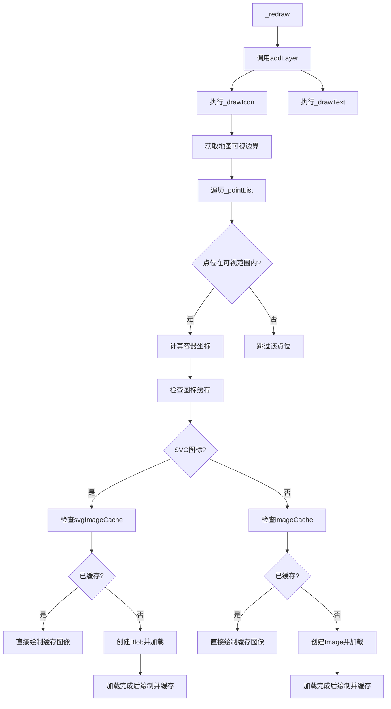
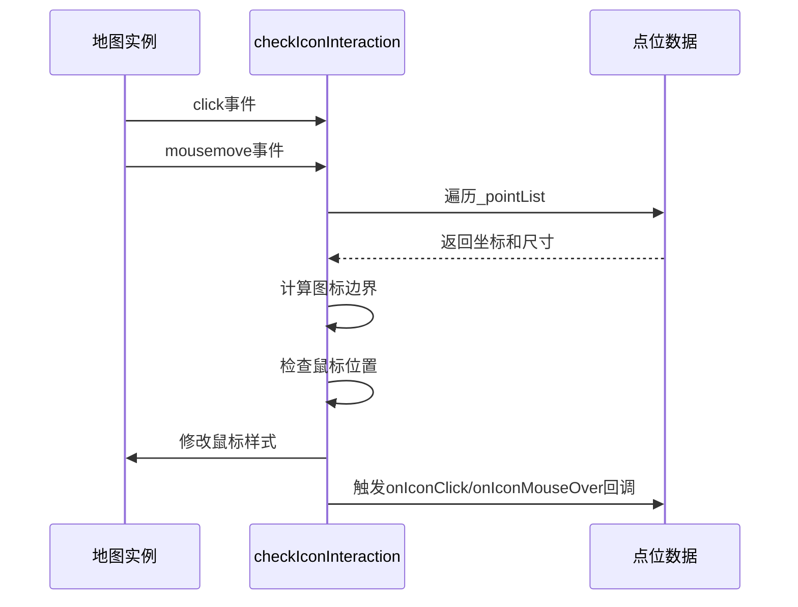

# 核心模块：海量点位渲染（ManyMarkersCanvas）

<cite>
**本文档引用文件**   
- [LeafletManyPoint.ts](file://src/lib/LeafletManyPoint.ts)
- [ReadMe.md](file://src/lib/ReadMe.md)
</cite>

## 目录
1. [核心类结构与继承机制](#核心类结构与继承机制)
2. [构造函数与数据结构](#构造函数与数据结构)
3. [Canvas渲染流程](#canvas渲染流程)
4. [事件代理机制](#事件代理机制)
5. [性能优化策略](#性能优化策略)

## 核心类结构与继承机制

`ManyMarkersCanvas` 类通过 `L.Layer.extend` 继承自 Leaflet 的 `L.Layer` 基类，实现了自定义 Canvas 图层的核心功能。该类在初始化时会执行 `initialize` 方法，并通过 `addTo` 方法将图层添加到地图实例中，触发 `onAdd` 生命周期方法。

`onAdd` 方法是图层添加到地图时的入口点，其主要职责包括：
- 保存地图实例引用到 `_map` 属性
- 调用 `_initCanvas` 创建 Canvas 元素
- 将创建的 Canvas 元素添加到地图的图层面板中
- 绑定地图事件监听器，包括移动结束（moveend）、窗口大小调整（resize）和缩放动画（zoomanim）

`onRemove` 方法在图层从地图移除时被调用，负责清理事件监听器和 DOM 元素，确保资源正确释放。

**Section sources**
- [LeafletManyPoint.ts](file://src/lib/LeafletManyPoint.ts#L19-L56)

## 构造函数与数据结构

`ManyMarkersCanvas` 的构造函数接受一个 `MarkerPointOptions` 类型的数组，该接口定义了每个标记点的核心属性：

- **lat**: 纬度坐标，表示点位的地理纬度
- **lng**: 经度坐标，表示点位的地理经度
- **title**: 标题文本，用于在点位下方显示文字标签
- **icon**: 图标资源，可以是图片 URL 或内联 SVG 字符串
- **iconSize**: 图标尺寸，一个包含宽度和高度的数字数组
- **onIconClick**: 点击回调函数，当用户点击该点位时触发
- **onIconMouseOver**: 鼠标悬停回调函数，当鼠标移入该点位时触发
- **onIconMouseOut**: 鼠标移出回调函数，当鼠标离开该点位时触发

在 `initialize` 方法中，传入的点位数组被赋值给 `_pointList` 实例属性，为后续的渲染和事件处理提供数据源。

**Section sources**
- [LeafletManyPoint.ts](file://src/lib/LeafletManyPoint.ts#L8-L17)

## Canvas渲染流程

`ManyMarkersCanvas` 的渲染流程围绕 `_redraw` 方法展开，该方法负责在地图视口变化时重新绘制所有可见点位。

**Diagram sources**
- [LeafletManyPoint.ts](file://src/lib/LeafletManyPoint.ts#L96-L132)

**Section sources**
- [LeafletManyPoint.ts](file://src/lib/LeafletManyPoint.ts#L96-L132)

### 可视范围过滤

`_drawIcon` 和 `_drawText` 方法首先通过 `this._map.getBounds()` 获取当前地图的可视边界，然后使用 `bounds.contains(latLng)` 判断每个点位是否在可视范围内。只有在可视范围内的点位才会进行坐标转换和绘制，这极大地提升了渲染性能，避免了对不可见点位的无效计算。

### 高效DOM变换

`_animateZoom` 方法利用 `L.DomUtil.setTransform` 对 Canvas 元素应用 CSS 变换。该方法接收缩放比例（scale）和偏移量（offset）作为参数，在地图缩放动画过程中平滑地调整 Canvas 的位置和大小，使点位图层能够无缝跟随地图的缩放变化，提供流畅的视觉体验。

## 事件代理机制

`ManyMarkersCanvas` 通过事件代理机制实现了点位的交互功能。在 `addTo` 方法中调用 `_initIconClickEvent` 初始化事件监听。

**Diagram sources**
- [LeafletManyPoint.ts](file://src/lib/LeafletManyPoint.ts#L208-L242)

**Section sources**
- [LeafletManyPoint.ts](file://src/lib/LeafletManyPoint.ts#L208-L242)

### 事件处理流程

1. **坐标缓存**: 使用 `containerPointsCache` Map 对象缓存已计算的屏幕坐标，避免在频繁的 `mousemove` 事件中重复调用 `latLngToContainerPoint`。
2. **边界检测**: 对于每个点位，根据其中心坐标和 `iconSize` 计算出左上角坐标 `(x, y)`，并确定其在屏幕上的矩形边界。
3. **命中测试**: 比较鼠标事件的坐标是否落在点位的矩形边界内，从而判断是否发生交互。
4. **状态管理**: 使用 `currentHoveredIcon` 变量跟踪当前悬停的点位，确保 `onIconMouseOut` 回调只在真正移出时触发，并正确管理鼠标光标样式。

## 性能优化策略

`ManyMarkersCanvas` 模块采用了多项性能优化技术，使其能够高效处理海量点位数据。

### 图标资源复用

模块使用两个独立的缓存 Map 对象：
- **imageCache**: 缓存普通图片资源（PNG、JPG等）
- **svgImageCache**: 缓存内联 SVG 图标资源

当绘制图标时，首先检查对应缓存中是否存在已加载的 `Image` 对象。如果存在，则直接使用缓存图像进行绘制；如果不存在，则创建新的 `Image` 实例，加载完成后将其存入缓存。这避免了对相同图标的重复网络请求和解码开销。

对于 SVG 图标，模块使用 `Blob` 和 `URL.createObjectURL` 技术将其转换为可加载的 URL，加载完成后立即调用 `URL.revokeObjectURL` 释放内存，防止内存泄漏。

### 自定义SVG图标使用

根据 `ReadMe.md` 文档，用户可以直接将 SVG 字符串作为 `icon` 属性值传入。模块通过检查 `icon.trim().startsWith('<svg')` 来识别 SVG 图标，并采用相应的加载和缓存策略。这种方式允许用户使用动态生成的矢量图标，而无需额外的网络请求。

### 性能建议

1. **合理设置可视范围**: 确保 `_pointList` 中的数据范围与地图的初始视图相匹配，避免加载过多不可见的点位。
2. **图标资源预加载**: 对于关键的图标资源，可以在图层初始化前手动预加载，避免首次渲染时的延迟。
3. **简化回调逻辑**: `onIconClick` 和 `onIconMouseOver` 回调应尽量轻量，避免执行耗时操作影响交互流畅性。
4. **批量更新**: 当需要更新大量点位数据时，建议先移除图层，更新数据后再重新添加，以触发一次完整的 `_redraw`，而不是逐个修改。

**Section sources**
- [LeafletManyPoint.ts](file://src/lib/LeafletManyPoint.ts#L96-L132)
- [ReadMe.md](file://src/lib/ReadMe.md#L270-L279)