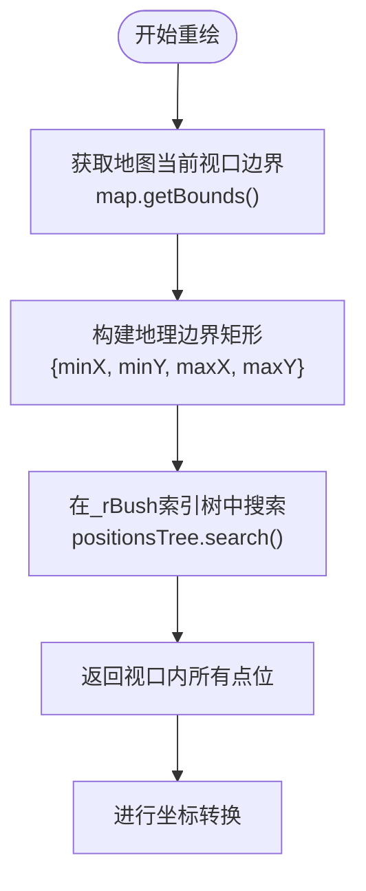
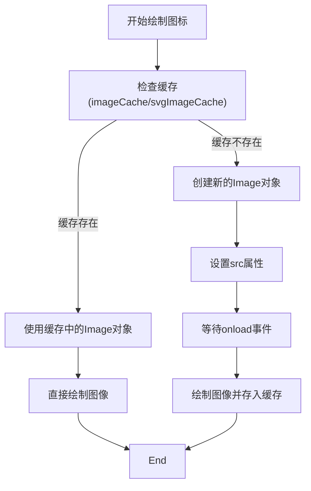

# 渲染机制

<cite>
**本文档引用的文件**
- [leaflet-markers-canvas.js](file://src\lib\leaflet-markers-canvas.js)
- [LeafletManyPoint.ts](file://src\lib\LeafletManyPoint.ts)
- [LeafletManyPoint copy.ts](file://src\lib\LeafletManyPoint copy.ts)
- [ReadMe.md](file://src\lib\ReadMe.md)
</cite>

## 目录
1. [引言](#引言)
2. [核心渲染流程](#核心渲染流程)
3. [可视区域过滤与坐标转换](#可视区域过滤与坐标转换)
4. [Canvas元素创建与图像绘制](#canvas元素创建与图像绘制)
5. [变换矩阵与DOM复用机制](#变换矩阵与dom复用机制)
6. [事件驱动的重绘逻辑](#事件驱动的重绘逻辑)
7. [性能优化策略](#性能优化策略)
8. [性能监控建议](#性能监控建议)

## 引言
ManyMarkersCanvas 是一个基于 Leaflet 的高性能 Canvas 图层组件，专为大规模点位渲染而设计。该组件通过智能过滤、坐标转换、图像缓存和变换矩阵等技术，实现了在地图缩放、平移过程中的流畅渲染体验。本文档深入分析其核心渲染机制，重点阐述 `_redraw` 方法如何高效处理大量点位数据，并结合代码实现说明性能优化策略。

## 核心渲染流程
ManyMarkersCanvas 的渲染流程始于图层添加至地图时的初始化，通过事件监听器响应地图状态变化，触发重绘逻辑。整个流程包括 Canvas 初始化、可视点过滤、坐标转换、图像绘制和变换应用等关键步骤。

**Section sources**
- [leaflet-markers-canvas.js](file://src\lib\leaflet-markers-canvas.js#L185-L237)
- [LeafletManyPoint.ts](file://src\lib\LeafletManyPoint.ts#L54-L100)

## 可视区域过滤与坐标转换
### 可视点位过滤
`_redraw` 方法首先利用 `getBounds()` 获取当前地图视口的地理边界，然后通过 RBush 空间索引树（`_positionsTree`）快速搜索出位于该边界内的所有点位。这种方法避免了遍历所有点位进行逐个判断，显著提升了过滤效率，尤其在处理海量数据时优势明显。

**Diagram sources**
- [leaflet-markers-canvas.js](file://src\lib\leaflet-markers-canvas.js#L341-L395)

### 地理坐标到像素坐标的转换
对于每一个位于可视区域内的点位，系统调用 `latLngToContainerPoint` 方法，将点的地理坐标（经纬度）转换为相对于地图容器的像素坐标。此转换是绘制的基础，确保了图标能准确地显示在地图的正确位置上。转换后的坐标会结合图标的 `iconAnchor`（锚点）和 `iconSize`（尺寸）进行偏移计算，以确定图像在 Canvas 上的最终绘制位置。

**Section sources**
- [leaflet-markers-canvas.js](file://src\lib\leaflet-markers-canvas.js#L341-L395)
- [LeafletManyPoint.ts](file://src\lib\LeafletManyPoint.ts#L96-L132)

## Canvas元素创建与图像绘制
### Canvas元素的创建与初始化
在 `onAdd` 生命周期中，通过 `L.DomUtil.create` 方法创建一个 `canvas` DOM 元素。该元素的宽度和高度被设置为当前地图视口的尺寸，确保其完全覆盖地图区域。同时，通过 `getContext('2d')` 获取 2D 绘图上下文，为后续的绘制操作做好准备。元素的 CSS 类名会根据地图是否支持缩放动画进行设置，以支持平滑的视觉效果。

**Section sources**
- [leaflet-markers-canvas.js](file://src\lib\leaflet-markers-canvas.js#L185-L237)
- [LeafletManyPoint.ts](file://src\lib\LeafletManyPoint.ts#L54-L100)

### 图像绘制与缓存机制
图像绘制通过 `context.drawImage` 方法完成。为了提升性能，系统实现了两级缓存机制：
1.  **普通图片缓存**：使用 `imageCache` Map 对象，以图片 URL 为键，存储已加载的 `Image` 对象。
2.  **SVG图片缓存**：使用 `svgImageCache` Map 对象，以 SVG 字符串为键，存储通过 `Blob` 和 `ObjectURL` 创建的 `Image` 对象。

在绘制前，系统会优先检查缓存。若存在，则直接使用；若不存在，则创建 `Image` 对象，设置 `onload` 回调，在图片加载完成后将其存入缓存并执行绘制，避免了重复加载，极大提升了渲染效率。

**Diagram sources**
- [LeafletManyPoint.ts](file://src\lib\LeafletManyPoint.ts#L96-L132)
- [ReadMe.md](file://src\lib\ReadMe.md#L270-L279)

## 变换矩阵与DOM复用机制
### L.DomUtil.setTransform 的作用
`L.DomUtil.setTransform` 是性能优化的核心。在地图进行缩放动画（`zoomanim` 事件）时，该方法被调用。它不直接重绘 Canvas 内容，而是通过修改 Canvas 元素的 CSS `transform` 属性，应用一个包含平移（`offset`）和缩放（`scale`）的变换矩阵。

*   **平移 (offset)**：通过 `_latLngBoundsToNewLayerBounds` 计算出地图视口变化后的新左上角坐标。
*   **缩放 (scale)**：通过 `getZoomScale` 获取当前缩放级别相对于上一级别的比例。

这种方法实现了“视觉上的”缩放和平移，由于无需重新绘制成千上万的点位，因此性能极高，保证了缩放动画的流畅性。只有在动画结束后的 `moveend` 事件中，才会触发一次完整的 `_redraw`，以更新实际的像素内容。

**Section sources**
- [leaflet-markers-canvas.js](file://src\lib\leaflet-markers-canvas.js#L391-L435)
- [ReadMe.md](file://src\lib\ReadMe.md#L146-L183)

## 事件驱动的重绘逻辑
系统的重绘由多个地图事件触发，确保了图层与地图状态的同步。
*   **moveend 事件**：当地图拖拽停止后触发，调用 `_reset` 方法。该方法会重新定位 Canvas 元素、调整其尺寸，并调用 `_redraw(true)` 进行完全重绘，以显示新视口内的点位。
*   **resize 事件**：当地图容器尺寸改变时触发，同样调用 `_reset` 进行重绘。
*   **zoomanim 事件**：在缩放动画过程中持续触发，调用 `_animateZoom`，通过 `setTransform` 实现平滑的视觉变换。
*   **zoomend 事件**：在 `LeafletManyPoint.ts` 中，缩放结束后会清空坐标缓存，确保下次重绘时使用最新的坐标。

这种事件驱动的模式，结合防抖（由事件本身控制）和可视区域裁剪，有效避免了在用户快速操作地图时的高频重绘，优化了渲染频率。

**Section sources**
- [leaflet-markers-canvas.js](file://src\lib\leaflet-markers-canvas.js#L123-L183)
- [LeafletManyPoint.ts](file://src\lib\LeafletManyPoint.ts#L128-L179)

## 性能优化策略
ManyMarkersCanvas 采用了多项关键技术来优化性能：
1.  **空间索引 (RBush)**：使用 `RBush` 库构建空间索引树，实现对可视区域内点位的快速查询，时间复杂度远低于线性遍历。
2.  **图像资源缓存**：通过 `Map` 对象缓存已加载的图片资源，避免重复的网络请求和解码开销。
3.  **可视区域裁剪**：在 `_drawIcon` 和 `_drawText` 方法中，通过 `bounds.contains(latLng)` 提前过滤掉视口外的点位，只渲染可见内容。
4.  **变换矩阵复用**：在缩放动画期间，利用 CSS `transform` 复用已绘制的 Canvas 内容，避免了昂贵的重绘操作。
5.  **坐标缓存**：在 `LeafletManyPoint.ts` 中，使用 `containerPointsCache` 缓存已计算的像素坐标，防止在鼠标移动事件中重复进行坐标转换。

这些策略共同作用，使得组件能够高效处理数以万计的点位数据。

**Section sources**
- [leaflet-markers-canvas.js](file://src\lib\leaflet-markers-canvas.js#L341-L395)
- [LeafletManyPoint.ts](file://src\lib\LeafletManyPoint.ts#L128-L179)
- [ReadMe.md](file://src\lib\ReadMe.md#L281-L328)

## 性能监控建议
为了确保应用的稳定性和用户体验，建议实施以下性能监控措施：
*   **限制最大渲染点数**：虽然组件性能优异，但应根据目标设备的性能设定一个合理的点位上限。当数据量过大时，可考虑采用聚合（clustering）或简化（simplification）策略。
*   **避免高频重绘**：确保 `_redraw` 调用是必要的。避免在短时间内（如循环中）多次调用 `redraw()`。利用组件内置的事件监听机制，让重绘由 `moveend` 等事件自然触发。
*   **监控内存使用**：图像缓存会占用内存。对于长时间运行的应用，应监控内存增长情况，必要时可实现缓存的过期或清理机制。
*   **使用性能分析工具**：利用浏览器的开发者工具（如 Chrome DevTools）的 Performance 面板，分析 `_redraw` 和 `_drawIcon` 等关键方法的执行时间，识别潜在的性能瓶颈。

**Section sources**
- [ReadMe.md](file://src\lib\ReadMe.md#L250-L273)