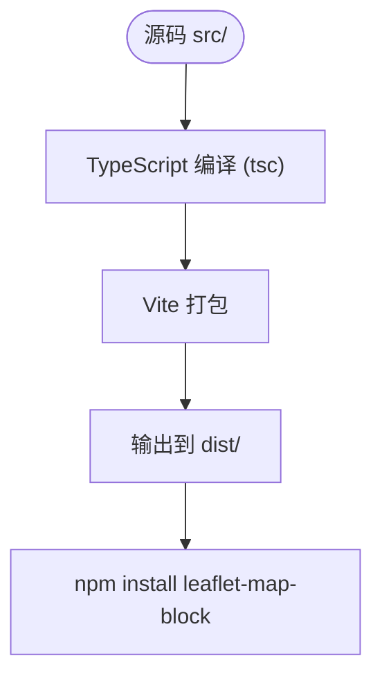

# 贡献指南

<cite>
**本文档引用的文件**  
- [README.md](file://README.md)
- [package.json](file://package.json)
- [vite.config.ts](file://vite.config.ts)
- [tsconfig.json](file://tsconfig.json)
- [src/lib/LeafletMapBlock.ts](file://src/lib/LeafletMapBlock.ts)
- [doc/README-ENG.md](file://doc/README-ENG.md)
</cite>

## 目录
1. [简介](#简介)
2. [开发环境搭建](#开发环境搭建)
3. [脚本命令说明](#脚本命令说明)
4. [代码提交规范](#代码提交规范)
5. [构建流程与配置](#构建流程与配置)
6. [问题报告与功能请求](#问题报告与功能请求)
7. [Pull Request 指南](#pull-request-指南)
8. [代码风格与测试](#代码风格与测试)

## 简介
本指南旨在帮助开发者参与 LeafletMapBlock 项目的改进与维护。该项目是一个基于 Vue 3 和 Leaflet 的地图分块渲染组件，支持在地图瓦片上绘制网格线和显示瓦片坐标（x, y, z），便于排查地图加载异常问题。通过本指南，您将了解如何搭建开发环境、运行项目、构建代码以及如何规范地提交代码变更。

**Section sources**
- [README.md](file://README.md#L0-L71)

## 开发环境搭建
要参与本项目的开发，请按照以下步骤进行环境配置：

1. **克隆仓库**  
   使用 Git 克隆项目到本地：
   ```
   git clone https://github.com/lizuoqun/LeafletMapBlock.git
   cd LeafletMapBlock
   ```

2. **安装依赖**  
   使用 npm 安装项目所需依赖：
   ```
   npm install
   ```

3. **启动开发服务器**  
   启动本地开发服务器以实时预览修改：
   ```
   npm run dev
   ```
   此命令将启动 Vite 开发服务器，默认在 `localhost:5173` 提供服务。

**Section sources**
- [package.json](file://package.json#L10-L13)
- [vite.config.ts](file://vite.config.ts#L1-L8)

## 脚本命令说明
`package.json` 中定义了多个 npm 脚本，用于不同的开发和构建场景：

| 脚本命令 | 用途说明 |
|--------|--------|
| `dev` | 启动开发服务器，支持热重载，用于本地开发调试 |
| `build` | 构建生产版本，执行 TypeScript 类型检查并使用 Vite 打包输出至 `dist` 目录 |
| `build-lib` | 仅使用 TypeScript 编译器（tsc）进行库的编译，适用于库模式构建 |
| `preview` | 预览已构建的静态文件，启动一个本地服务器展示 `dist` 内容 |

**Section sources**
- [package.json](file://package.json#L10-L16)

## 代码提交规范
为保持项目代码历史清晰可追溯，请遵守以下提交规范：

- **分支管理策略**：  
  - `main` 分支为稳定主分支，所有功能开发应在独立分支完成并通过审查后合并。
  - 功能开发建议使用 `feature/xxx` 命名分支，修复问题使用 `fix/xxx`。

- **提交消息格式**：  
  提交信息应简洁明了，建议采用如下格式：
  ```
  feat: 添加新功能描述
  fix: 修复某问题描述
  docs: 更新文档
  style: 代码格式调整
  refactor: 重构代码
  test: 添加或修改测试
  chore: 构建或工具变更
  ```
  示例：
  ```
  fix: 修正网格文字颜色未生效问题
  feat: 支持自定义字体大小配置
  ```

**Section sources**
- [README.md](file://README.md#L0-L71)

## 构建流程与配置
本项目使用 **Vite** 作为构建工具，**TypeScript** 作为开发语言，构建流程依赖以下关键配置文件：

- **tsconfig.json**：  
  主要 TypeScript 配置文件，指定编译选项如目标版本（ES6）、模块格式（CommonJS）、输出目录（`./dist`）等，并包含声明文件生成（`declaration: true`）。该配置确保类型定义文件 `.d.ts` 被正确生成。

- **vite.config.ts**：  
  Vite 构建配置文件，当前配置启用 Vue 插件以支持 `.vue` 文件解析。未来可扩展为库模式打包（library mode），设置入口文件和输出格式。

- **构建输出**：  
  构建后生成的文件包括：
  - `dist/LeafletMapBlock.js`：主 JavaScript 文件
  - `dist/LeafletMapBlock.d.ts`：类型定义文件
  - 支持通过 `import { LeafletMapBlockLayer } from 'leaflet-map-block/dist/LeafletMapBlock'` 引用组件



**Diagram sources**
- [tsconfig.json](file://tsconfig.json#L0-L13)
- [vite.config.ts](file://vite.config.ts#L1-L8)
- [package.json](file://package.json#L4-L7)

**Section sources**
- [tsconfig.json](file://tsconfig.json#L0-L13)
- [vite.config.ts](file://vite.config.ts#L1-L8)

## 问题报告与功能请求
我们欢迎用户提交 Issue 来报告 bug 或提出新功能建议：

- **Bug 报告**：请在 [GitHub Issues](https://github.com/lizuoqun/LeafletMapBlock/issues) 中描述问题现象、复现步骤及环境信息。
- **功能请求**：可提交新功能建议，说明使用场景和预期效果。
- **标签分类**：请合理使用标签（如 `bug`、`enhancement`、`documentation`）以便维护者快速分类处理。

**Section sources**
- [README.md](file://README.md#L65-L71)
- [package.json](file://package.json#L30-L33)

## Pull Request 指南
我们非常欢迎社区贡献 Pull Request（PR）：

1. Fork 项目并创建新分支。
2. 实现功能或修复问题，确保代码风格一致。
3. 提交 PR 到 `main` 分支，附上清晰的描述和相关截图（如 UI 变更）。
4. 维护者将审查代码并提出反馈，修改后可合并。

请确保 PR 内容聚焦单一功能或修复，避免混杂多个不相关变更。

**Section sources**
- [README.md](file://README.md#L65-L71)

## 代码风格与测试
为保证代码质量，请遵守以下原则：

- **代码风格**：保持与现有代码一致的命名规范、缩进和注释风格。建议使用 Prettier 或 ESLint（若已配置）进行格式化。
- **单元测试**：当前项目暂未提供测试文件，但未来建议为关键功能（如 `createTile` 方法）添加单元测试，确保逻辑正确性。
- **类型安全**：充分利用 TypeScript 类型系统，避免 `any` 类型滥用，确保接口定义清晰。

**Section sources**
- [src/lib/LeafletMapBlock.ts](file://src/lib/LeafletMapBlock.ts#L0-L78)