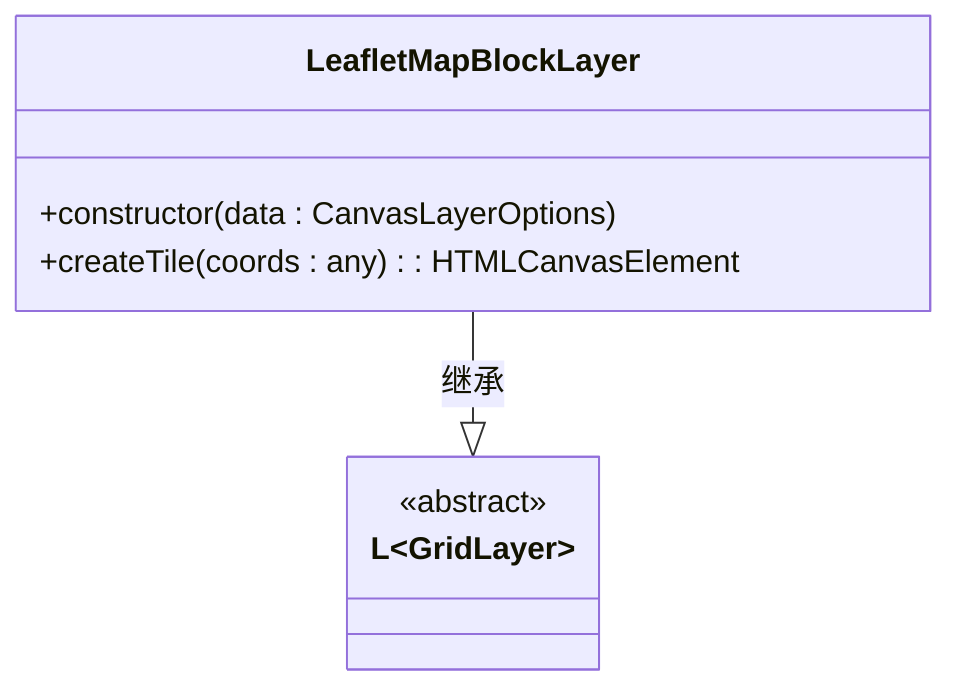
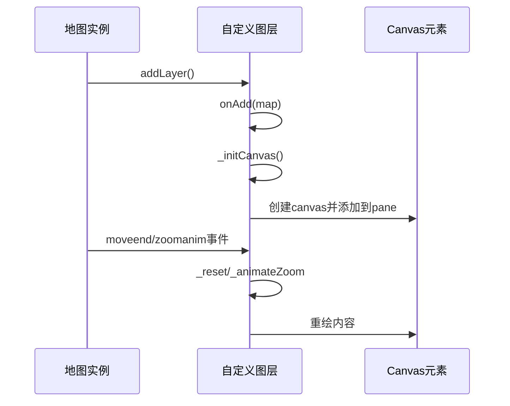

# 项目概述

<cite>
**本文档引用的文件**  
- [README.md](file://README.md)
- [package.json](file://package.json)
- [src/lib/LeafletMapBlock.ts](file://src/lib/LeafletMapBlock.ts)
- [src/lib/LeafletManyPoint.ts](file://src/lib/LeafletManyPoint.ts)
</cite>

## 目录
1. [简介](#简介)
2. [项目结构](#项目结构)
3. [核心功能模块](#核心功能模块)
4. [架构与设计模式](#架构与设计模式)
5. [性能优化机制](#性能优化机制)
6. [使用场景与示例](#使用场景与示例)
7. [元信息与依赖](#元信息与依赖)
8. [总结](#总结)

## 简介

LeafletMapBlock 是一个基于 Vue 3 和 Leaflet 的前端地图可视化组件库，旨在解决在 Web 地图上渲染海量地理数据时的性能瓶颈问题。传统基于 DOM 的标记渲染方式在处理万级点位时会导致严重的性能下降，而本项目通过 Canvas 技术实现高效绘制，显著提升了渲染效率和交互流畅性。

该项目主要包含两大核心功能模块：`ManyMarkersCanvas` 用于大规模点数据的高性能渲染，`LeafletMapBlockLayer` 用于地图瓦片网格与坐标标注。这些功能不仅适用于大规模数据展示，也适用于地图服务异常排查等运维场景。

## 项目结构

```
.
├── doc                     # 文档目录（含英文版说明）
├── src
│   ├── lib                 # 核心库文件
│   │   ├── LeafletManyPoint.ts       # 万级点位Canvas渲染模块
│   │   ├── LeafletMapBlock.ts        # 地图分块网格图层模块
│   │   └── 其他辅助文件
│   ├── App.vue             # Vue 应用主组件
│   ├── main.ts             # 入口文件
│   └── 其他资源文件
├── README.md               # 项目说明文档
├── package.json            # 项目元信息与依赖
└── 其他构建配置文件
```

**Section sources**  
- [README.md](file://README.md#L1-L71)
- [package.json](file://package.json#L1-L44)

## 核心功能模块

### ManyMarkersCanvas：万级点位的Canvas高效渲染

`ManyMarkersCanvas` 是一个自定义的 Leaflet 图层类，继承自 `L.Layer`，专门用于在地图上高效渲染大量标记点。它通过 HTML5 Canvas 实现非 DOM 渲染，避免了浏览器对成千上万个 DOM 节点的管理开销。

该模块支持自定义图标（支持图片和 SVG）、文字标签，并提供了点击、悬停等交互事件回调。通过可视区域裁剪（`bounds.contains(latLng)`）和图标缓存机制（`imageCache` 和 `svgImageCache`），确保只渲染当前视口内的点位，极大提升了性能。

**Section sources**  
- [src/lib/LeafletManyPoint.ts](file://src/lib/LeafletManyPoint.ts#L19-L260)

### LeafletMapBlockLayer：地图瓦片网格与坐标标注

`LeafletMapBlockLayer` 继承自 `L.GridLayer`，用于在地图上渲染带有网格线和文本标注的瓦片图层。每个瓦片都是一个 `<canvas>` 元素，在其上绘制红色虚线网格，并标注该瓦片的 `x`, `y`, `z` 坐标值。

此功能对于地图服务调试非常有价值。当某块地图加载异常时，开发者可通过坐标快速定位其对应的静态资源 URL（如 `https://{s}.tile.openstreetmap.org/{z}/{x}/{y}.png`），从而排查服务器响应或缓存问题。



**Diagram sources**  
- [src/lib/LeafletMapBlock.ts](file://src/lib/LeafletMapBlock.ts#L28-L77)

**Section sources**  
- [src/lib/LeafletMapBlock.ts](file://src/lib/LeafletMapBlock.ts#L1-L78)
- [README.md](file://README.md#L10-L25)

## 架构与设计模式

### 面向对象的设计

项目采用典型的面向对象设计模式，利用 TypeScript 的类和接口特性构建可维护的代码结构。例如：

- `LeafletMapBlockLayer` 类封装了网格图层的所有行为。
- `ManyMarkersCanvas` 使用 `L.Layer.extend()` 扩展 Leaflet 原生图层功能。
- 定义了 `MarkerPointOptions` 接口来规范点位数据结构，确保类型安全。

这种设计使得组件易于复用、扩展和测试。

### 与 Leaflet 图层系统的集成

两个核心模块均深度集成 Leaflet 的图层系统：

- `LeafletMapBlockLayer` 继承 `L.GridLayer`，遵循瓦片图层生命周期（`createTile`）。
- `ManyMarkersCanvas` 继承 `L.Layer`，重写 `onAdd`, `onRemove`, `_reset`, `redraw` 等生命周期方法，响应地图的移动、缩放事件。

通过 `map.addLayer(new LeafletMapBlockLayer())` 即可将自定义图层添加到地图实例中，完全兼容 Leaflet 的插件生态。



**Diagram sources**  
- [src/lib/LeafletManyPoint.ts](file://src/lib/LeafletManyPoint.ts#L30-L35)
- [src/lib/LeafletMapBlock.ts](file://src/lib/LeafletMapBlock.ts#L30-L35)

## 性能优化机制

### 可视区域裁剪

在 `_drawIcon` 和 `_drawText` 方法中，首先判断点位是否位于当前地图视口内（`bounds.contains(latLng)`），仅渲染可见点，大幅减少不必要的绘制操作。

### 图标缓存机制

使用 `Map` 对象实现图像缓存：
- `imageCache`: 缓存普通图片资源
- `svgImageCache`: 缓存 SVG 字符串转换后的图像

避免重复加载相同图标，减少网络请求和解码开销。

### 坐标转换缓存

`containerPointsCache` 缓存经纬度到容器坐标的转换结果，在地图移动时清空缓存，平衡性能与内存占用。

### 动画与重绘优化

通过 `requestAnimationFrame` 实现平滑动画，并在缩放时使用 CSS3 变换（`L.DomUtil.setTransform`）避免频繁重绘，提升用户体验。

**Section sources**  
- [src/lib/LeafletManyPoint.ts](file://src/lib/LeafletManyPoint.ts#L150-L180)

## 使用场景与示例

### 大规模点数据展示

适用于展示城市POI、用户分布、设备位置等万级点位数据，保持地图流畅操作。

```typescript
import { ManyMarkersCanvas } from 'leaflet-map-block/dist/LeafletManyPoint';

const points = [
  { lat: 39.9, lng: 116.4, title: '北京', icon: 'pin.png', iconSize: [20, 20] }
  // ... 更多点位
];

const markerLayer = new ManyMarkersCanvas(points);
map.addLayer(markerLayer);
```

### 地图服务异常排查

启用 `LeafletMapBlockLayer` 后，每块地图将显示其 `x,y,z` 坐标，便于快速定位问题瓦片。

```typescript
import { LeafletMapBlockLayer } from 'leaflet-map-block/dist/LeafletMapBlock';
map.addLayer(new LeafletMapBlockLayer({ lineDash: [2, 2] }));
```

**Section sources**  
- [README.md](file://README.md#L40-L60)
- [src/lib/LeafletManyPoint.ts](file://src/lib/LeafletManyPoint.ts#L1-L261)

## 元信息与依赖

根据 `package.json` 文件，项目基本信息如下：

- **名称**: leaflet-map-block
- **版本**: 0.0.1
- **作者**: Modify
- **许可证**: MIT
- **关键词**: leaflet, map, vue3
- **主页**: [https://github.com/lizuoqun/LeafletMapBlock](https://github.com/lizuoqun/LeafletMapBlock)

### 核心依赖

| 包名 | 用途 |
|------|------|
| `leaflet` | 地图引擎 |
| `vue` | 前端框架（Vue 3） |
| `coordtransform` | 坐标系转换工具 |
| `rbush` | R树空间索引（可用于进一步优化） |

### 开发依赖

使用 Vite + Vue 3 + TypeScript 构建现代前端工作流，支持类型检查与高效打包。

**Section sources**  
- [package.json](file://package.json#L1-L44)

## 总结

LeafletMapBlock 项目通过 Canvas 技术有效解决了 Web 地图中大规模点数据渲染的性能难题。其两大核心模块 `ManyMarkersCanvas` 与 `LeafletMapBlockLayer` 分别针对数据可视化与地图运维提供了实用解决方案。

项目采用 TypeScript 实现类型安全，遵循 Leaflet 插件开发规范，具备良好的可扩展性和集成性。结合 Vue 3 生态，适合构建高性能地理信息可视化应用。未来可结合 `rbush` 实现空间索引查询，进一步提升交互性能。